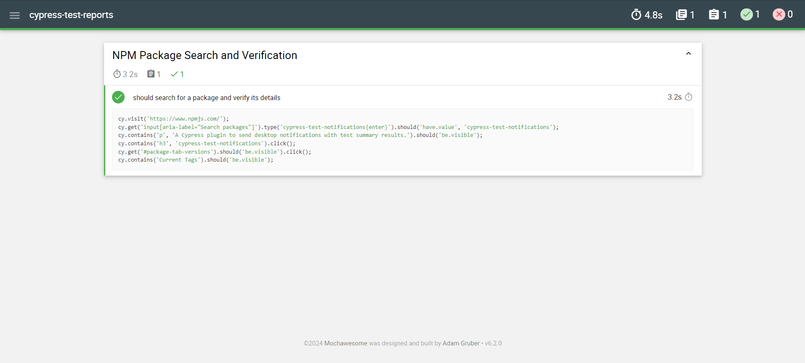
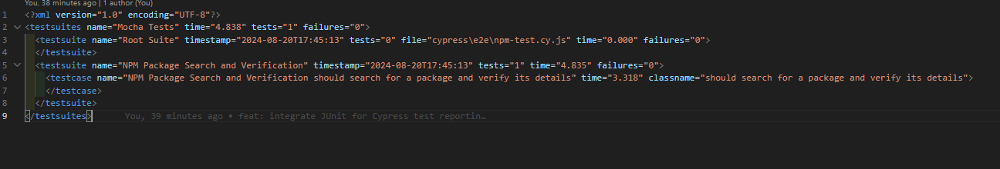
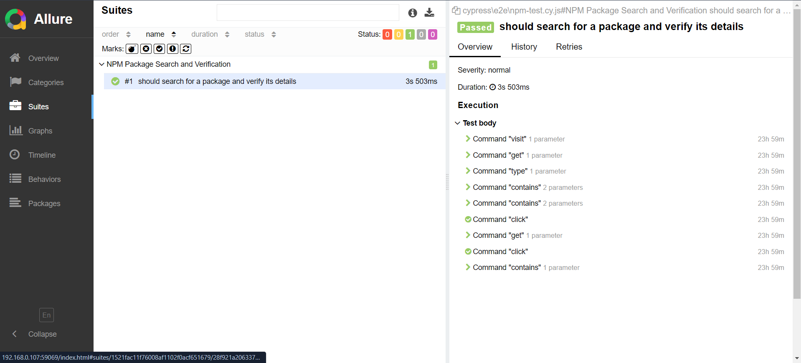

Here's the updated README in English:

---

# Cypress Reporters

This project uses Cypress for integration testing and supports multiple reporters. Navigate through the branches below to view the setup and usage of each reporter.

## Branches

- **`reporter/Allure`** - Setup and usage of the Allure reporter.
- **`reporter/JUnit`** - Setup and usage of the JUnit reporter.
- **`reporter/Mochawesome`** - Setup and usage of the Mochawesome reporter.

## Cloning the Project

To clone the project and start using the different reporters, follow these steps:

1. Clone the repository:
    ```bash
    git clone https://github.com/your-username/your-repository.git
    ```

2. Navigate to the project directory:
    ```bash
    cd your-repository
    ```

3. Install the dependencies:
    ```bash
    npm install
    ```

## Test Scripts

Depending on which reporter you want to use, run one of the following commands:

### Mochawesome

To run tests with the Mochawesome reporter:
```bash
npm run test:mocha
```

#### Mochawesome Report



### JUnit

To run tests with the JUnit reporter:
```bash
npm run test:junit
```

#### JUnit Report



### Allure

To run tests with the Allure reporter and generate the report:
```bash
npm test
```

To generate and view the report:
```bash
npm run allure:report
npm run allure:open
```

To serve the Allure report on a local server:
```bash
npm run allure:serve
```

#### Allure Report



